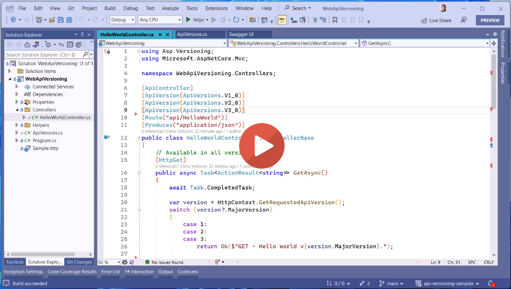

# API Versioning Samples
Demonstration of API versioning extensions

## Overview

Versioning is a common requirement for APIs. This sample demonstrates how to use the API versioning extensions to support versioning in an API.

## Demo

## References

- [ASP.NET API Versioning Library](https://github.com/dotnet/aspnet-api-versioning)
- [Microsoft REST API Guidelines](https://github.com/Microsoft/api-guidelines/blob/master/Guidelines.md#12-versioning)
- [Microsoft Azure REST API Guidelines](https://github.com/microsoft/api-guidelines/blob/vNext/azure/Guidelines.md#api-versioning)
- [Power Platform Versioning and support](https://learn.microsoft.com/en-us/power-platform/admin/programmability-versioning-support)
